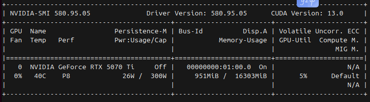
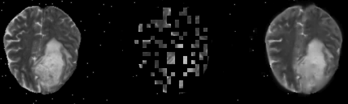
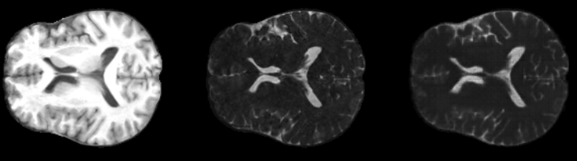
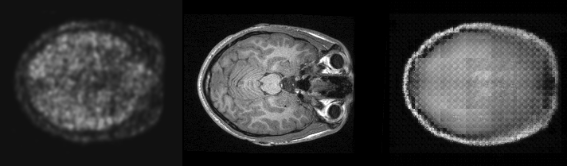
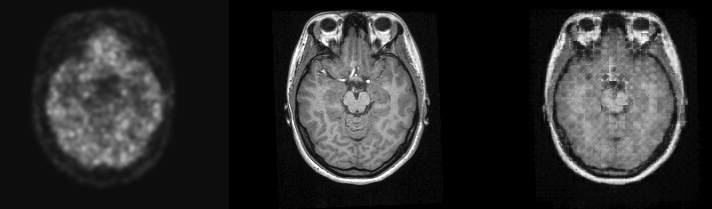

## Objective: 
Develop an image-to-image translation method for PET to T1
(positron emission tomography to T1 magnetic resonance iamges)

## Constraints
T1 should be of sufficient image quality for accurate gray/white/ventricle segmentation using standard procesing protocols.<br>
Use only open source, publicly available data sources<br>
Trainable in < 48 hours single mid-grade GPU (specs below)<br>
Inference including preprocessing pipeline < 60 seconds<br>



## Project plan
Source data from public challenge data sets ISLES, BRaTS, etc.<br>
Set up ETL pipeline using pipeline orchestrator (dagster)<br>
Use self-supervision paradigm to learn a multi-modal latent space representation<br>
Minimize dependence on difficult to train architectures<br>

## Planned Architecture
Three networks are planned

1. Vision transformer as encoder network
Stores latent multi-model representation
Patch-wise reconstruction loss with masked auto-encoder setup

2. Decoder for ViT in the pre-training stage (patch-wise reconstruction)

3. SwinUNET fine-tuned on T1|PET pairs for the primary image-to-image translation task

## Progress
Pre-trained transformer results

Example validation data set from the pre-training (<24 hours training)


Example Fine-tuned on T1 to FLAIR data task (using pretrained ViT encoder)
Training time < 12 hours, 16 GB 
left-to-right: T1 image (input), FLAIR ground truth, network prediction<br>


## PET image sourcing
Openneuro Monash data set available with PET and MRI data in same sessions
Preprocessing pipeline required to set up fine-tuning

Here is one slice from the Monash resting state fMRI-PET data set from open neuro.
With some preprocessing and registration to the corresponding MRI this could
serve as a fine-tuning data set for the PET->T1 task


## Image preparation fmr PET-T1 image-to-image translation
cd ./self_supervised_learning/etl
python run_etl_pipeline.py

## PET-T1 image-to-image translation initial results
* 20 paired slices selected from one of the PET timepoints
* 150 epochs of fine-tuning
* pre-training on the mae task with multi-modal MRI (no PET in training)
* nuumber of subjects: Train: 9, Val: 2, Test: 2 

Result of PET to T1 image-to-image translation after 150 epochs



## Additional Data for Fine Tuning PET-T1
Increase the number of paired slices in finetuning
Distribution:
Train: 9 subjects (360 slices)
Val: 2 subjects (80 slices)
Test: 2 subjects (80 slices)




## Inference on Test Data

### Running PET-to-T1 Inference

After training is complete, use the standalone inference script to apply the trained model to test data:

```bash
# Activate the mtnet conda environment
eval "$(conda shell.bash hook)" && conda activate mtnet

# Run inference on all test samples (default)
python scripts/pet_to_t1_inference.py

# Or run on a specific number of samples
python scripts/pet_to_t1_inference.py --num_samples 5
```

### Command-Line Options

```bash
python scripts/pet_to_t1_inference.py \
    --test_data_dir /home/rbussell/data/pet_mri/test/ \
    --encoder_ckpt /home/rbussell/repos/mtnet/weight/pet_mri_finetune/E.pth \
    --generator_ckpt /home/rbussell/repos/mtnet/weight/pet_mri_finetune/G.pth \
    --output_dir ./outputs/pet_t1_inference/ \
    --num_samples 80
```

**Options:**
- `--test_data_dir`: Directory containing test .npy files (default: /home/rbussell/data/pet_mri/test/)
- `--encoder_ckpt`: Path to encoder checkpoint E.pth (default: /home/rbussell/repos/mtnet/weight/pet_mri_finetune/E.pth)
- `--generator_ckpt`: Path to generator checkpoint G.pth (default: /home/rbussell/repos/mtnet/weight/pet_mri_finetune/G.pth)
- `--output_dir`: Base output directory (default: ./outputs/pet_t1_inference/)
- `--num_samples`: Number of samples to process (default: all samples in test directory)

### Inference Outputs

The script generates timestamped output directories with the following structure:

```
outputs/pet_t1_inference/run_YYYYMMDD_HHMMSS/
├── visualizations/           # PNG comparison images
│   ├── 000441.png           # Input PET | Predicted T1 | Ground Truth T1
│   ├── 000442.png
│   └── ...
├── metrics.csv              # Quantitative evaluation metrics
└── config.json              # Run configuration for reproducibility
```

**Visual Outputs:**
- 3-panel comparison images showing:
  - Left: Input PET image
  - Center: Predicted T1 image (with PSNR and SSIM metrics overlaid)
  - Right: Ground truth T1 image

**Metrics CSV:**
- Per-sample metrics: PSNR, SSIM, NMSE
- Summary statistics: mean and standard deviation across all samples

### Test Set Performance

**Latest results on 80 test samples (2 subjects, 40 slices each):**
- **PSNR**: 15.29 ± 0.54 dB (Peak Signal-to-Noise Ratio)
- **SSIM**: 0.56 ± 0.04 (Structural Similarity Index)
- **NMSE**: 0.33 ± 0.06 (Normalized Mean Squared Error)
- **Inference Time**: ~24 seconds for 80 slices (~3.3 samples/second on RTX 5070 Ti)
- **Memory**: Processes one sample at a time to minimize GPU memory usage

### Implementation Details

The inference pipeline:
1. Loads the trained MAE encoder (E.pth) and MTNet generator (G.pth)
2. Processes test .npy files containing paired (T1, PET) data
3. Extracts features using the encoder
4. Generates T1 predictions using the generator
5. Calculates quality metrics (PSNR, SSIM, NMSE)
6. Saves visual comparisons and quantitative results

**Code Location:**
- Main script: `scripts/pet_to_t1_inference.py`
- Metrics: `ssl_utils/metrics.py`
- Visualization: `ssl_utils/visualization.py`

## Citation
we thank these sources for code and ideas
Tao 2023: arXiv:2212.01108v3
Liu 2023: arXiv:2311.04049v1